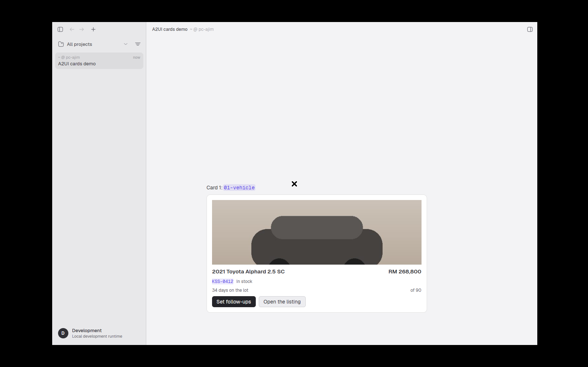
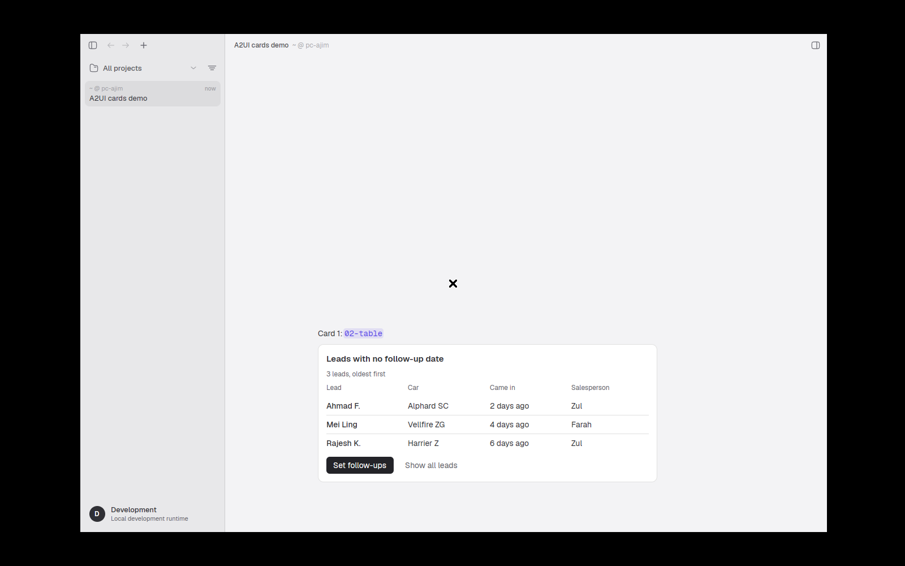
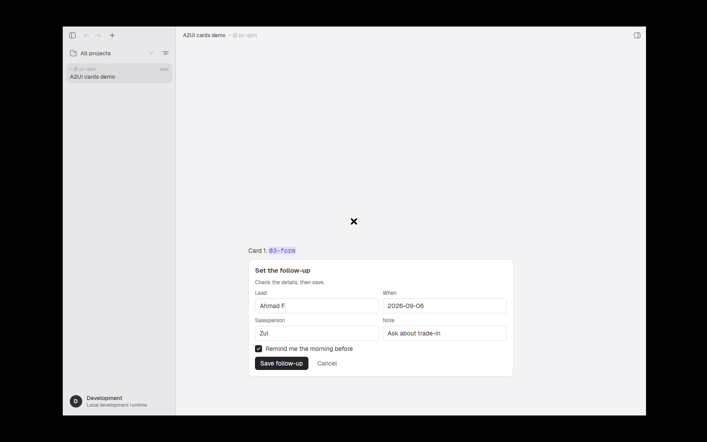
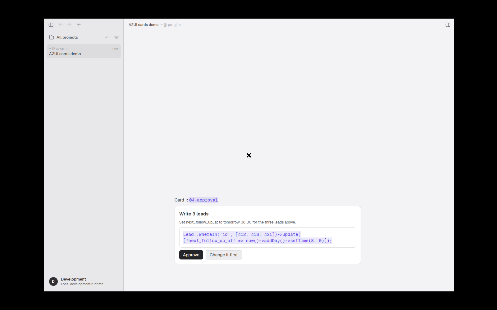
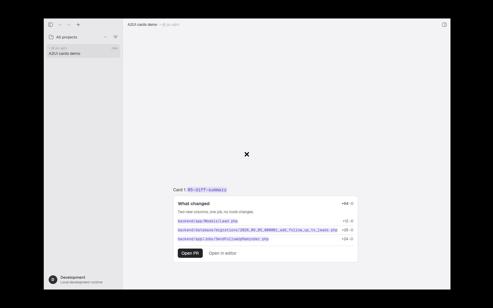
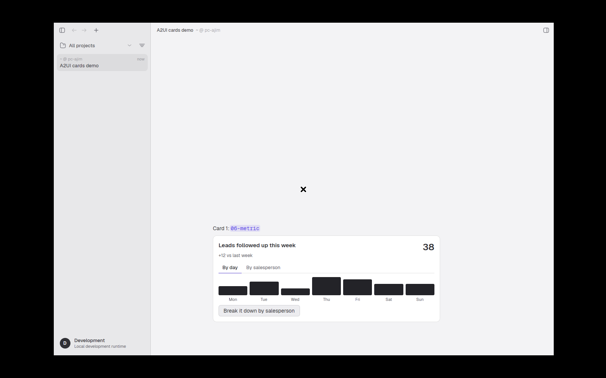

# Cards for agents

A card is an answer drawn as a small native panel instead of typed out as text.
The agent sends a short JSON description, surya draws it in the transcript, and a tap on one of its buttons goes back to the agent as the user's next message.
This page follows one card from the agent's prompt to that tap, in plain words, with the file and line behind every claim.

Owner ruling behind all of it (`docs/decisions.md:151`, decision 14): "surya knows no business, workspaces bring their own cards."
The six built-in shapes are generic, and a repo can add its own under `.surya/cards`.

## The path, end to end

```
 agent (Claude Code inside surya)
   |
   |  1. reads the prompt append + the surya-cards skill
   |  2. calls mcp__surya__show_card({ card: {...} })
   v
 surya-mcp (sidecar)            writes one JSON line -->  ~/.surya/cards.jsonl
   |  returns card_id                                      (the card store)
   v
 harness (engine)               on the tool result, reads that line by tool_use_id
   |  emits AgentEvent::Card                                   |
   v                                                           |
 transcript doc                 MessagePart::Card, one row, height memoized
   |
   v
 surya app                      draws it with the native A2UI renderer
   |
   |  user taps a button
   v
 composer                       sends "[card:<id>] <action> <payload>" as the user's turn
   |
   v
 agent                          reads it like any typed message
```

Proof that the whole chain holds, with one counter pair per hop, is the test `app/crates/ui/src/cards_e2e.rs` (PR #24).

## 1. How the agent learns about cards

Two files teach it, and both ship inside the app.
The append rides every turn's system prompt, so it stays short: when a card beats prose, and the six shape names.
The skill is loaded only when the agent draws a card: the JSON per shape and the raw A2UI escape hatch.

| What | Where | How it reaches the agent |
| --- | --- | --- |
| The prompt append | `app/assets/surya-system-append.md` | The harness embeds it (`harness/src/claude/surya.rs:26`) and writes it to the run folder as `system-append.md` before every run (`surya.rs:206-212`). |
| The cards skill | `app/assets/skills/surya-cards/SKILL.md` | The harness embeds it (`surya.rs:33`, PR #47), lays it out in the run folder as a one-skill plugin (`write_cards_plugin`, `surya.rs:315-321`) and starts Claude Code with `--plugin-dir` (`claude/mod.rs:254-255`). The agent then sees it as the skill `surya:surya-cards` and can also invoke it as `/surya:surya-cards` (surya-mcp, measured against Claude Code 2.1.261, `surya.rs:53`). |

The append opens with the situation the agent is in: "surya is a desktop app, not a terminal. The person reading you sees a native window".
Then it gives the rule for when to draw instead of write.
Its own words:

| Show a card when the answer is | Shape |
| --- | --- |
| one thing and its fields | `record` |
| a list to scan or compare | `table` |
| something for the user to fill in | `form` |
| something about to happen that needs a yes or no | `approval` |
| which files changed and by how much | `diff-summary` |
| one number and its movement | `metric` |

And the manner: "When you show a card, keep the reply text to one line. The card is the answer."

The skill's description line says what it is for: "Write a card for surya to draw instead of answering in prose. Use when the answer is a record, a list, a form, a yes/no decision, a set of file changes, or a number".
It carries one worked JSON example per shape, the raw A2UI escape hatch, and the rule for workspace cards.

## 2. The show_card tool

The sidecar `surya-mcp` offers three tools to the agent.
Claude Code shows them to the model as `mcp__surya__show_card`, `mcp__surya__list_cards` and `mcp__surya__send_message` (`app/crates/mcp/src/protocol.rs:30-32`).

The tool's own description (`protocol.rs:37-42`): "Show the user a card instead of writing the answer as prose. Use it for a choice, a status, a record, a comparison, or a form."

Its input has two fields:

| Field | Required | Meaning (quoted from `protocol.rs:47-56`) |
| --- | --- | --- |
| `card` | yes | "Either a short-form object carrying \"shape\", or an A2UI envelope message, or a list of A2UI envelope messages." |
| `surface_id` | no | "Reuse an existing surface id to replace a card you already showed. Omit it for a new card." |

A short-form card looks like this (from the append):

```
show_card({ card: {
  "shape": "approval",
  "title": "Run the migration?",
  "summary": "Adds two columns to leads. No data is dropped.",
  "code": "php artisan migrate --step"
}})
```

The six shapes, in the sidecar's words (`app/crates/mcp/src/shapes.rs:18-47`):

| Shape | What it draws |
| --- | --- |
| `record` | "One thing with its fields: title, optional image, label/value rows, badges, actions." |
| `table` | "Rows and columns. Use when the answer is a list the user will scan." |
| `form` | "Fields the user fills in and submits. Text, select and date fields." |
| `approval` | "A thing about to happen, its summary and the code or command, with approve and reject." |
| `diff-summary` | "Which files changed and by how much, with a one-line note." |
| `metric` | "One number with its change and an optional short series." |

Every shape takes `title` and an optional `actions` list of `{"label", "event", "context"}`.
The first action becomes the primary button.
A card with no `shape` and no A2UI is refused with the message in `shapes.rs:166`: "card is missing \"shape\"; use one of: record, table, form, approval, diff-summary, metric - or pass A2UI messages instead".

`list_cards` (`protocol.rs:81-85`) returns "surya's six built-in shapes plus any cards this workspace brings in .surya/cards".
The append tells the agent to call it once per workspace.

### What the sidecar records

On every accepted call the sidecar expands the short form into A2UI messages and appends one JSON line to the card store (`app/crates/mcp/src/cards.rs:87-116`).

```
{
  "card_id":     "card_<uuid>",
  "surface_id":  "<the card_id, unless the agent reused one>",
  "tool_use_id": "<Claude Code's id for this tool call>",
  "agent_id":    "<who drew it>",
  "workspace":   "<where>",
  "at":          "<UTC time>",
  "a2ui":        [ ...the expanded messages... ]
}
```

The store is `~/.surya/cards.jsonl` unless the run sets another path (`harness/src/claude/surya.rs:280`).
When the file passes 8 MB it is renamed to `cards.jsonl.1` and a fresh one starts (`mcp/src/config.rs:116-130`).
The tool answers the agent with the `card_id`, and the card is already on screen.

### How the app matches the record to the call

The harness never parses the tool's text reply.
When the tool result for a `show_card` call arrives, it reads the store backwards and picks the line whose `tool_use_id` matches (`surya.rs:237`).
That line becomes one `AgentEvent::Card`, and the tool chip for that call is dropped, because the card is the chip.
A call that failed keeps its chip, so the user can see the agent tried (`harness/tests/claude.rs`, test `a_resolved_show_card_call_emits_one_card_event_in_transcript_order`).
When there is no store to read, for example a run without surya options, the harness lifts the card out of the call's own input instead (`harness/src/claude/normalize.rs:70-78`).

## 3. What the user sees

The card is one row in the transcript, drawn with surya's own colours and fonts so it sits on the same plane as the tool chips beside it.
It is at most 600 px wide (`app/crates/a2ui/src/render.rs:25`) and its height is measured once and kept, like every other row.

The six built-in shapes, as drawn on this box on 2026-09-05:

| Shape | Frame |
| --- | --- |
| record |  |
| table |  |
| form |  |
| approval |  |
| diff-summary |  |
| metric |  |

The frames predate design critique round 2.
Since PR #31 code inside a card takes the text colour on a neutral wash, only the tallest metric bar is bright, and card headings start at 20 px.

Above the card the agent's reply is one line.
If the agent breaks that rule and repeats the card in prose, the prose is the agent's fault, not the renderer's.

## 4. How a tap comes back

A button carries an `action` with an event name and a context.
When the user taps it, the app builds one line of text and sends it as the user's own turn.
The composer's comment (`app/crates/ui/src/composer.rs:4747-4749`): "Send `text` as the user's turn without touching the input: a card button's answer (`[card:<id>] <action> <payload>`), typed by a tap. A live run is steered, an idle chat resumed, exactly like Enter."

The wire form is fixed in `app/crates/proto/src/card.rs:25-36`:

```
[card:<card_id>] <event name> <context as JSON>
```

For example, the primary button on the vehicle record sends:

```
[card:card_3f9a2c1e] set_follow_ups {"stockNo":"KSS-0412"}
```

The agent receives that as a message and answers it like any other.
Two shapes add their own events, in the skill's words: a form's submit button sends the form's data, and an approval's buttons "send `surya_approve` and `surya_reject` with your `context`".

Text fields, check boxes and tabs work without a round trip.
Typing, ticking and switching tabs change the card's data model on the spot.
A button whose context points at those values, as the form's submit does, sends them along.

## 5. The catalog

The renderer draws the eleven A2UI basic-catalog components below, plus one surya extension, `BarChart`.
A card may name any other component; it is drawn as a labelled box reading "Unsupported: <name>" (`app/crates/a2ui/src/render/panel.rs:23`), never a crash.

Every card is a flat list of components linked by id.
One of them must be `root`.
Containers name their children by id and never nest them inline.
A value can be a literal, a binding into the data model as `{"path": "/key"}`, or a call to a small function such as `formatString`.

| Component | What it is | One example, taken from `app/crates/a2ui/fixtures/` |
| --- | --- | --- |
| Text | A line or paragraph. Variants h1 to h5, body, caption. Bold, italic and code marks inside. | `{"id":"title","component":"Text","text":{"path":"/title"},"variant":"h4"}` |
| Image | A picture. Variants icon, avatar, smallFeature, mediumFeature, largeFeature, header. Fit contain, cover, fill, none, scaleDown. | `{"id":"photo","component":"Image","url":{"path":"/photo"},"variant":"header","fit":"cover","description":"Stock photo"}` |
| Button | A tap target with an action. Variants default, primary, borderless. | `{"id":"follow_ups","component":"Button","variant":"primary","child":"follow_ups_label","action":{"event":{"name":"set_follow_ups","context":{"stockNo":{"path":"/stockNo"}}}}}` |
| TextField | One input, bound to the data model. Variants shortText, longText, number, obscured. | `{"id":"lead","component":"TextField","label":"Lead","value":{"path":"/form/lead"},"weight":1}` |
| CheckBox | A tick with a label, bound to a boolean. | `{"id":"remind","component":"CheckBox","label":"Remind me the morning before","value":{"path":"/form/remind"}}` |
| Row | Children side by side. `justify` and `align` as in the spec. | `{"id":"head","component":"Row","justify":"spaceBetween","align":"start","children":["head_left","price"]}` |
| Column | Children stacked. | `{"id":"body","component":"Column","children":["photo","head","meta","footer"]}` |
| List | Repeats one template component per item of an array in the data model. Vertical or horizontal. | `{"id":"rows","component":"List","direction":"vertical","children":{"componentId":"row","path":"/leads"}}` |
| Card | The plate. The root Card is the panel itself; a nested Card is an inset box. | `{"id":"root","component":"Card","child":"body"}` |
| Divider | A hairline. | `{"id":"divider","component":"Divider"}` |
| Tabs | Titled panes, one shown at a time. | `{"id":"tabs","component":"Tabs","tabs":[{"title":"By day","child":"by_day"},{"title":"By salesperson","child":"by_person"}]}` |
| BarChart (surya) | A row of bars from an array. `values` points at the array, `valueKey` and `labelKey` name the fields, `max` fixes the scale. | `{"id":"by_day","component":"BarChart","values":{"path":"/series"},"valueKey":"value","labelKey":"label"}` |

The functions a value may call (`app/crates/a2ui/src/data.rs`): `formatString`, `formatNumber`, `formatCurrency`, `required`, `not`, `and`, `or`, `length`, `numeric`, `email`.

The full spec is A2UI v0.9.1 in the `a2ui-project/a2ui` repository, Apache-2.0.
Nothing was copied from it.

## 6. Rules a card cannot break

A card comes from an agent, and an agent can be wrong or hostile.
The renderer treats every card as untrusted input.
When a rule trips, the card degrades to a diagnostics panel with the reason, and the rest of the transcript is untouched.
The four cards under `app/crates/a2ui/fixtures/hostile/` prove it, in the test `hostile_fixtures_degrade_to_diagnostics` (`app/crates/ui/src/cards.rs:325`).

| Rule | Limit | Source |
| --- | --- | --- |
| Inline image (`data:` URL) | at most 2 MB, only png, jpeg, webp, gif | `a2ui/src/images.rs:13`, `:114-117` |
| Image from a file | only under the chat's own folder, at most 20 MB | `images.rs:15`, `ui/src/cards.rs:39-53` |
| Image from the web | drawn as a placeholder naming the host, never fetched | `images.rs:57-66`, `ui/src/cards.rs:51` |
| Any other URL scheme | refused with the reason | `images.rs:71` |
| Components in one card | 2,000 | `a2ui/src/parse/mod.rs:12` |
| Drawn nodes per render | 5,000 | `a2ui/src/budget.rs:16` |
| Nesting depth | 24 | `a2ui/src/render.rs:21` |
| Items a List may repeat | 200 | `render.rs:23` |
| Tabs | 16 | `render.rs:31` |
| Text in one component | 4,000 characters | `a2ui/src/leaf.rs:24` |
| A label | 200 characters | `leaf.rs:26` |
| Bars in a BarChart | 60 | `leaf.rs:365` |
| Array index a path may name | 10,000 | `a2ui/src/data.rs:11` |
| Decoded images kept per card | 64 | `a2ui/src/state.rs:14` |

Three things a card can never do at all: run code, fetch from the network, or inject HTML.
Decision 4 (`docs/decisions.md:32`) states the last one as a rule of the format: "The agent never emits raw HTML."

## 7. Testing without an agent

Three knobs let a person, or a script, put cards on screen with no Claude Code run.

| Knob | What it does | Source |
| --- | --- | --- |
| `SURYA_DEMO_CARDS=<dir>` | Seeds a chat named "A2UI cards demo" with one turn per `*.json` in the folder. Seeds once; clicking another chat keeps that chat (PR #34). | `app/crates/ui/src/shell.rs:1342` |
| `SURYA_MOCK_CARDS=<dir>` with `SURYA_HARNESS=mock` | The mock agent streams the folder's cards through the real engine path after any typed prompt. | `app/crates/harness/src/mock.rs:184` |
| `SURYA_CARD_STATS=1` | Prints one log line per card row: `card rows synced asked= built=`, `card rendered`, `card measured width= height=`. | `app/crates/ui/src/cards.rs:32` |

The six sample cards live in `app/crates/a2ui/fixtures/01-vehicle.json` to `06-metric.json`.
A run that draws them all reads `card rows synced asked=6 built=6` in its log.

The recipe used for every screenshot on this page:

```
SURYA_DEMO_CARDS=app/crates/a2ui/fixtures SURYA_HARNESS=mock \
RUST_LOG=info,surya_a2ui=info SURYA_WORKOS_CLIENT_ID= SURYA_IPC_PORT=27992 surya
```

Give every proof run its own `SURYA_IPC_PORT`.
The default port attaches the app to whatever engine is already running on the box.

## Where things live

| Piece | Path |
| --- | --- |
| Prompt append | `app/assets/surya-system-append.md` |
| Cards skill | `app/assets/skills/surya-cards/SKILL.md` |
| Sidecar tools, shapes, store | `app/crates/mcp/src/{protocol,shapes,cards,config}.rs` |
| Harness: store lookup and Card event | `app/crates/harness/src/claude/{surya,normalize}.rs` |
| Wire form of a tap | `app/crates/proto/src/card.rs` |
| Renderer, parser, limits | `app/crates/a2ui/src/` |
| Transcript row and knobs | `app/crates/ui/src/{transcript,cards,shell}.rs` |
| Fixtures and hostile cards | `app/crates/a2ui/fixtures/` |
| End-to-end test | `app/crates/ui/src/cards_e2e.rs` |
