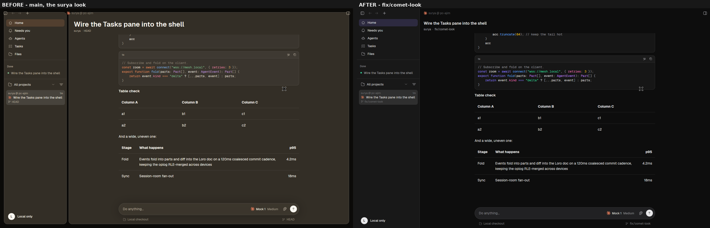
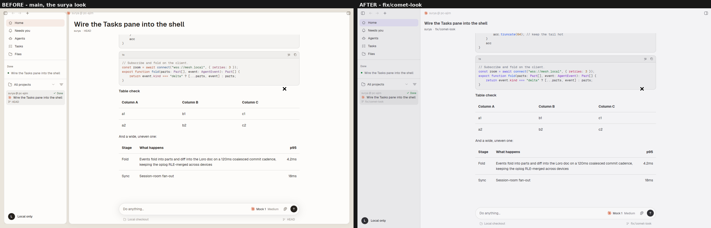
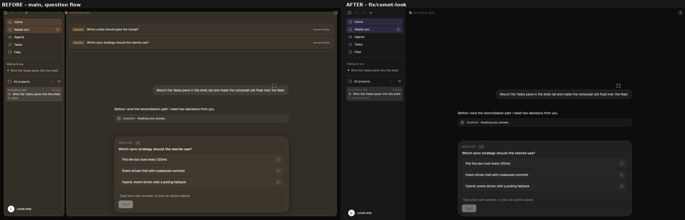

# Comet's look, restored

The app looks like surya's comet again.
Every feature stays.

## The order

Owner, 2026-09-05 19:25, relayed by jag-0905-raven, verbatim:

> just revert back the gui to how surya's comet look. can you do that?

then, one minute later:

> i mean only the theme, not functionality, features

then at 19:26:

> and the box/modal, remove them. the implementation is just atrocious and pure lazy

then at 19:32, which settled how far the revert goes:

> the new gui should look like surya's comet, but with our feature built in

## The reference

Comet's own product screenshots are in this repo, at the subtree import commit
`fe35546`.
They are the reference, and they are citable by path:

| Path at `fe35546` | Size | What it shows |
| --- | --- | --- |
| `apps/landing/public/assets/app-screenshot.jpg` | 2560x1655 | The whole window: transcript, composer pill, diff pane |
| `apps/landing/public/assets/shots/sessions.png` | 907x627 | The session list and its selected row |
| `apps/landing/public/assets/shots/diff.png` | 907x627 | The changes pane |
| `apps/landing/public/assets/shots/history.png` | 907x627 | History |

Read one with `git show fe35546:apps/landing/public/assets/app-screenshot.jpg > /tmp/ref.jpg`.

All four are dark.
Comet shipped no light screenshot, so light is proved by token and by code, not
by a reference pixel.

## Before and after

Same binary tree, same rig, same seed.
The only difference between the two columns is the commit.
Left is `origin/main` at `20616ef`, right is `fix/comet-look`.
Shot with `app/scripts/critic-shots.sh` on the shared headless Xorg `:7`,
`panics=0` on all sixteen frames.

| | 1440x900 | 1100x700 |
| --- | --- | --- |
| Dark | [shell-dark-1440x900.png](comet-restore/shell-dark-1440x900.png) | [shell-dark-1100x700.png](comet-restore/shell-dark-1100x700.png) |
| Light | [shell-light-1440x900.png](comet-restore/shell-light-1440x900.png) | [shell-light-1100x700.png](comet-restore/shell-light-1100x700.png) |





## The question flow

This is the part the owner called atrocious.
Same pairs, with a question open.

| | 1440x900 | 1100x700 |
| --- | --- | --- |
| Dark | [question-dark-1440x900.png](comet-restore/question-dark-1440x900.png) | [question-dark-1100x700.png](comet-restore/question-dark-1100x700.png) |
| Light | [question-light-1440x900.png](comet-restore/question-light-1440x900.png) | [question-light-1100x700.png](comet-restore/question-light-1100x700.png) |



Three things changed and one deliberately did not.

The two "Question ... answer below" boxes pinned above the feed are gone.
The needs-you rows are a plain list in the sidebar, not cards.
The window is flat.

The rounded glass question panel **stayed**.
surya-states checked and it is comet's own: `render_wizard` on this branch is
byte-identical to comet's at the import commit, 204 lines,
md5 `e14d577e3f5cf9102abdcda01c10bae7` on both sides.
Removing it would have been a new design decision, not a revert, and the owner's
19:32 message settles which way that goes.

### The needs-you row, before and after

surya-states, `crates/ui/src/inbox/chrome.rs`.

Before, at `ffa7cd5`:

```rust
pub fn row_card(theme: &Theme) -> Div {
    div()
        .flex().flex_col().gap(px(6.0)).p(px(10.0))
        .rounded(px(10.0))
        .border_1()
        .border_color(theme.border)
        .bg(theme.surface_card)
}
```

After, at `6e7c87d`:

```rust
pub fn row_line(theme: &Theme, first: bool) -> Div {
    div()
        .flex().flex_col().gap(px(6.0)).px(px(2.0)).py(px(10.0))
        .when(!first, |el| el.border_t_1().border_color(theme.border))
}
```

Gone: the corners, the outline, the fill.
`p(10)` became `px(2)/py(10)` because a line does not need side padding inside a
pane that already has 12.

## Measured, not eyeballed

Every number here was produced this session by reading the primary source.

### The theme is comet's, unmodified

| Check | Result |
| --- | --- |
| `comet_dark()` vs `fe35546` | byte-identical, 33 lines, md5 `ba0cd47865ab4552c49db58f70bbe4c8` |
| `comet_light()` vs `fe35546` | byte-identical, 33 lines, md5 `165e100a5201a1bb66a44c9fe627d238` |
| `fn variant()` vs `fe35546` | byte-identical, 73 lines |
| `Theme::from_variant` vs `fe35546` | 101 lines both sides, **one** added line, additive: `theme.warning_wash = warning_wash_for(...)` |
| `glass_hover`, `input_glass_bg`, `wash`, `is_frost` | identical |
| `BUBBLE_RADIUS` 16, `PANEL_RADIUS` 10, `CONTROL_RADIUS` 6 | unchanged since the import |

`ThemeSelection::default()` is `surya-light` / `surya-dark` again, and so is the
registry fallback.
System following is untouched.

### The floating layout is gone, in pixels

One scanline, `y=500`, dark, 1440x900, run-length encoded.

Before, `origin/main`:

```
x=   0  (11,10,8)     16px   <- canvas margin
x=  17  (51,46,38)   254px   <- the rail, a card
x= 272  (11,10,8)      5px   <- the gap between two cards
x= 281  (51,46,38)  1142px   <- the conversation, a card
x=1427  (11,10,8)     13px   <- canvas margin
```

After, `fix/comet-look`:

```
x=   0  (24,24,24)   255px   <- the sidebar column, flush to the window edge
x= 255  (48,48,48)     1px   <- its right hairline
x= 256  (13,13,13)   ...     <- the main area, to the window edge
```

The 16px canvas inset is 0.
The 8px inter-panel gap is 0.
Two planes meet at a 1px hairline, which is what comet draws.

### Against comet's own frame

Comet's window is frosted over a purple desktop, so its absolute RGB carries the
wallpaper and will never match a headless grab composited over black.
The relation is what transfers, and it does:
in `app-screenshot.jpg` at `y=1100` the left column reads `(29,19,43)` against a
main area of `(13,9,24)`.
Ours reads `(24,24,24)` against `(13,13,13)`.
Lighter sidebar, darker main, hairline between.

## What happened to it afterwards

Nothing here was kept.
Decision 34, 2026-09-08, deleted `crates/ui/src/surya.rs`, both theme variants
and the design brief and critique rounds that judged them.
The look is comet's own and it is not to be proposed again.
This document stays only as the record of how the revert was done.

The reduced-motion switch stays.
`SURYA_WINDOW_SIZE`, which the shot rig needs, stays.

## Deviations, written down rather than left silent

**Decision 20 is superseded.**
It said the needs-you queue sits at the top of the feed, at full weight.
Replacement, written by surya-states, who wrote the original:

> The needs-you queue is the spine of the app, and it lives on its own page in
> the sidebar. It is a plain list, not cards, and it never sits over the
> transcript: the feed is the conversation, and a queue drawn on top of it hides
> the composer the user needs to answer with. Superseded the original wording
> (2026-09-05, owner via raven 19:26 and 19:32) - the same queue, moved off the
> feed and stripped of its boxes.

**Session-row sub-lines went back to `text_muted.opacity(0.5)`.**
That is comet's own value and it measures about 2.3:1 on the panel, under AA.
Round 2 of the design critique had moved it to `text_faint` for that reason.
The reading still stands; the order is comet's look, so it went back with the
rest, and this is the one place where fidelity and legibility disagree.

**Two tasks-pane cards moved off a literal `12.0` onto `Theme::PANEL_RADIUS`.**
Comet has no task board, so there is no reference screen.
Comet's card radius is 10 and has been since the import, so our board is drawn in
comet's radius language.

**The nav rail keeps its accent-tinted selected wash.**
This was queried and cleared.
The rail paints `theme.element_active`, a comet token, and comet derives that
token from the accent: `builtins.rs:125`, `active: accent.primary.with_alpha(if
dark { 0.18 } else { 0.10 })`, in a function that is byte-identical to the
import.
Comet has two selected treatments and always did, accent-tinted for
`element_active` and neutral `glass_selected_bg` for the session list, and we use
each where comet uses it.

## Review round 1 (#82)

The reviewer returned FIX with two real findings. Both are recorded here rather
than only in the commit, because the first one is a mistake worth not repeating.

**The Needs you rail entry opened nothing.**
Setting the mount to `None` removed the shell's only mount of `NeedsYouPane`, so
the rail entry and its shortcut toggled nothing while the entry kept
highlighting and kept showing its badge.
The comment I wrote said the list "lives in the sidebar's Needs you page".
No such page existed.
The "Waiting for you" block visible in the sidebar of my own frames is the
`AgentsRail`, a different component, and I read it as proof without checking.

Fixed by making it a real page.
`inbox_visible` now means exactly "the Needs you page is open"; the old
auto-open on `count > 0` is gone, and that auto-open is how the queue came to be
drawn over the conversation in the first place.
The pane mounts as the main-area outlet, the way Settings does, not as a strip
above the transcript.
The chat title stands down while it is up, the page takes the titlebar
clearance, and the composer is suppressed under it.
Main area rather than sidebar section because the rows carry a title, a prompt
line and actions, and a 256px sidebar truncates all three.

**Existing installs would have kept the surya colours.**
`ui-settings.json` stores the theme selection as two strings and is rewritten on
every settings change, so every install that ran a build between PR #2 and this
revert holds `surya-light` / `surya-dark` explicitly - the owner's box included.
The chrome would have reverted and the colours would not, which is the worst of
both.

`UiSettings` now carries a `schema_version`, and `migrated()` maps the surya pair
back to comet's **once**, only for a file written before the field existed.
Two tests: one that a pre-revert file comes back holding comet's pair, one that
choosing surya deliberately afterwards survives the next launch.
Without the second, the theme list would have an option that silently undoes
itself.

Two minor items also closed: `docs/decisions.md` now separates the Rust function
names from the variant id strings, and records that the planned surya-to-surya
rename has to move the default selection and add a second settings migration or
it drops users onto the fallback.
The theme contrast test covers the default pair again, at comet's own measured
numbers.

## Review round 2 (#82, at `ec42930`)

One finding, and it was the kind only a second pair of eyes catches: the Needs
you page had no way out.

Making the queue a page put it over the whole main area, and nothing closed it.
`OpenChat` selected the chat *behind* the page, so the conversation and the
sheet the row points at both stayed underneath the queue.
The collapsed row focused the composer directly, which was correct while the
list was a strip above the feed, but the shell suppresses the composer while the
page is up, so the click focused something that was not on screen.
Both exits looked like a click that did nothing.

Fixed at `6b2a763`: the shell's subscriber sets `inbox_shown = Some(false)` on
the way out, and the collapsed row emits `OpenChat(row.chat_id)` instead of
focusing, so both paths route through the same close-then-select.
The dead strip mount, its measuring canvas and the `inbox_stack` field went with
it.

Worth recording why this nearly reached the owner.
`ec42930` was built for Windows and launched for him before the fix existed.
The sidebar shows a "Needs you" badge, which is exactly what a curious owner
clicks first, and the build shown to prove his complaint was fixed would have
trapped him on a page with no visible way back.
He was warned, and the build was rebuilt at `6b2a763`.

## Comet's contrast, measured

The default-pair test prints these and holds the floors just under them, so a
palette that drifts is caught without pretending comet clears a bar it does not.

| role | worst | where | WCAG |
| --- | --- | --- | --- |
| body | 11.84 | light canvas | AAA, twice over |
| muted | 5.45 | light canvas | AA |
| faint | 3.90 | light canvas | **under AA** |
| accent | 6.09 | dark panel | AA |

`surya-light` panel and card: body 13.13, muted 6.04, faint 4.32.
`surya-dark` panel: 16.56, 8.66, 5.52.

`text_faint` misses AA on the canvas plane, and in comet's flat layout the canvas
is the sidebar column, which carries real text: session rows and their
sub-lines.
It is the same defect as the sub-line item above, one layer down.

Ruling, raven 21:48: comet's value stays unmodified for the RC, because the
order is comet's look.
Both land on the post-RC list as one owner question - "faint text in light mode
misses AA in two places, nudge it or keep comet's value" - carrying these
numbers.

## Still open

Permissions.
Comet renders none at the import commit and `surya_doc::MessagePart` has no
`Permission` variant, so making them inline would be doc and engine work, not a
look change.
They render as they did.
Flagged to raven by surya-states.

## Green

`cargo build -p surya` exit 0.
`surya-theme` 26 passed, 0 failed.
`surya-ui` 652 passed, 0 failed.
Sixteen frames, `panics=0` on every one.
