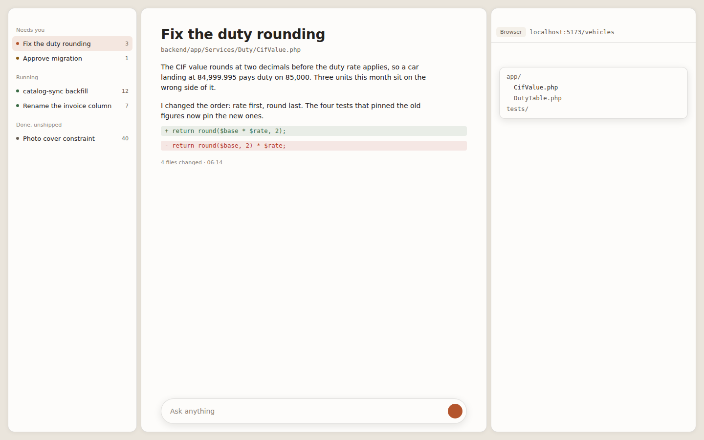
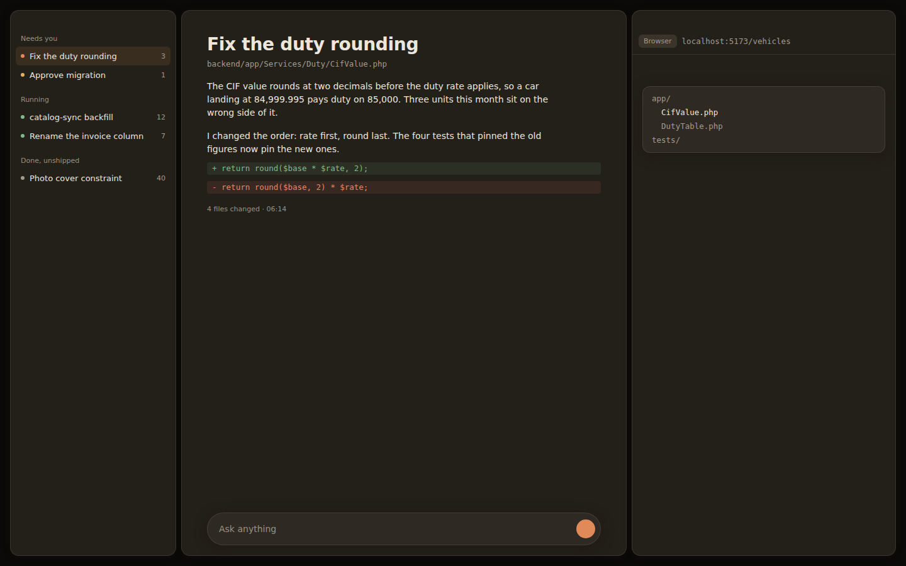
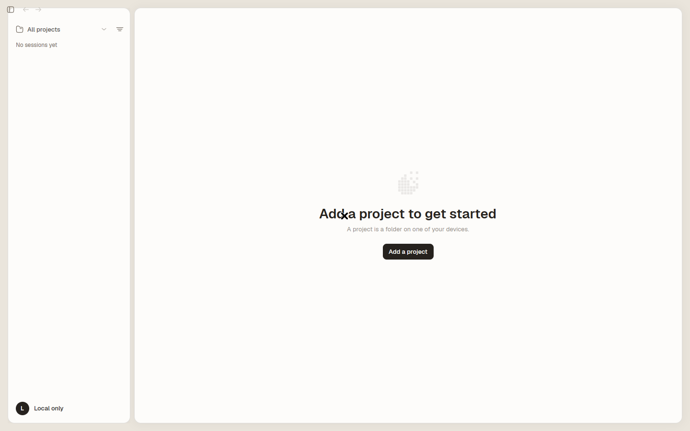
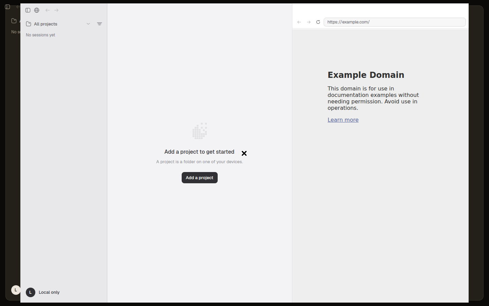
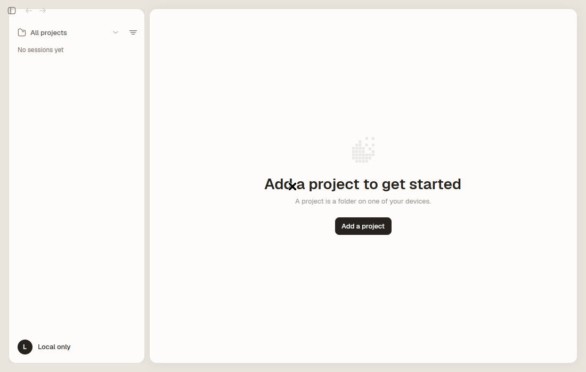
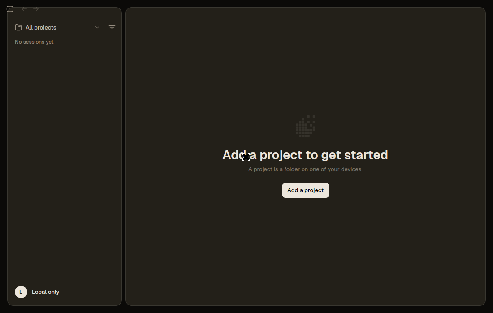

# The surya look

> **Superseded 2026-09-05.**
> The owner reversed this at 19:25: "just revert back the gui to how zeron's
> comet look", then "i mean only the theme, not functionality, features", then
> at 19:32 "the new gui should look like zeron's comet, but with our feature
> built in".
> The app ships comet's own `zeron-light` / `zeron-dark` again and comet's flat
> chrome. See [comet-look-restore.md](comet-look-restore.md).
> Nothing below was deleted. `surya-light` and `surya-dark` are still built in
> and still pickable in Appearance, and `crates/ui/src/surya.rs` still holds
> the geometry and the type scale. This page is what those describe, kept so
> that bringing the look back is a decision and not a rebuild.

Floating rounded panels on a soft canvas.
Light first, dark as good.
Decision 22, from the owner's three sketches: "inspiration: raycast, craft, cleanshot".





Those two images are the palette and the geometry rendered from the real token
values. Real frames of the running app are under "Proof" at the bottom.

## The layout

```
+------------------------------------------------------------------+
|  16px canvas margin                                              |
|  +----------+ 8 +---------------------------+ 8 +-------------+  |
|  |          |   |                           |   | url bar     |  |
|  |  rail    |   |   conversation            |   |-------------|  |
|  |  card    |   |                           |   | +---------+ |  |
|  |          |   |                           |   | | files   | |  |
|  |          |   |   +-------------------+   |   | | card    | |  |
|  |          |   |   |  composer  pill   |   |   | +---------+ |  |
|  +----------+   +---------------------------+   +-------------+  |
+------------------------------------------------------------------+
```

Three panels, each its own card.
The canvas shows between them.
The file browser is a card floating over the right pane, CleanShot style.

## The numbers

| Token | Value | Where |
|---|---|---|
| Canvas margin | 16px | window edge to the outermost panel |
| Panel seam | 8px | between two panels |
| Panel radius | 14px | the three panels |
| Float radius | 12px | a card resting on a panel |
| Control radius | 6px | chips, inputs, buttons |
| Composer radius | 26px | pinned, so a growing pill stays a pill |

The margin is twice the seam on purpose.
At 10 against 8 the two read as the same measurement and the panels looked scattered.

## The type

| Step | Size | Weight | Used for |
|---|---|---|---|
| Display | 28px | 600 | session title, the one heading on an empty window |
| Title | 19px | 600 | panel and page headers |
| Body | 14px | 400 | prose and rows |
| Label | 13px | 500 | buttons and chips |
| Caption | 11px | 500 | timestamps, counts |
| Mono | 12.5px | 400 | paths, ids, branches |

Display over body is **2.00**.
Body over caption is **1.27**.
Counts and PR numbers use tabular figures, so a number that changes in place does not jitter.

## The colour

One accent, terracotta, and warm neutrals.
Never pure black on pure white.

| | Light | Dark |
|---|---|---|
| Canvas | `#eae5dc` | `#0b0a08` |
| Panel | `#fdfcfa` | `#232019` |
| Card on a panel | `#fdfcfa` | `#2e2922` |
| Text | `#26221e` | `#ece6dc` |
| Accent | `#b4552d` | `#e08a5a` |

Light and dark are not each other inverted.
In light the panel is the brightest thing and the card on top of it stays level, separated by a hairline and a shadow.
In dark every layer climbs: canvas, then panel, then card.
A dark card painted in the panel's own tone disappears into it, which is exactly what the first render showed.

## Depth without glass

Every panel gets its depth from four things that work on any build of gpui:
the canvas tone under it, a hairline border, one soft shadow, and the gap.

Not from backdrop blur.
The browser pane may swap comet's gpui fork for Zed's own, which has no blur and no transparent window.
Glass still works where the fork offers it, but it is never the mechanism.

Two elevation levels and no more: a panel on the canvas, and a card on a panel.
One shadow each, never a stack - layered shadows sum into a grey rim on a light field.

## Motion

The panels already slide open and closed on comet's own width tween.
What was missing was the off switch.

Settings now carries a **Motion** row with three states.

| Choice | Effect |
|---|---|
| System | follows this machine's reduce-motion setting |
| Full | full travel |
| Reduced | panels change state without travel, feedback stays |

`System` reads the macOS accessibility flag and GNOME's `enable-animations`.
Windows has no reader yet and falls back to full motion.
This closes the gap `docs/PARITY.md` 1.12 records.

## Proof

Four frames of the running app on the headless Xorg, `screens=4 looked=4`.

| | |
|---|---|
|  |  |
|  |  |

The geometry is measured off the dark 1100x700 frame, not eyeballed.
A scanline through the middle of the window reads:

```
x=0..15    canvas    16px   window margin
x=16       hairline   1px   rail card border
x=17..270  panel    254px   rail card
x=271      hairline   1px
x=272..279 canvas     8px   panel seam
x=280      hairline   1px
x=281..    panel            conversation card
```

Vertically the top margin is 16px and the bottom margin is 16px.
Outer 16, inner 8, exactly as designed.

The dominant colours are the tokens themselves: `#fdfcfa` panel over `#eae5dc` canvas in light, `#232019` over `#0b0a08` in dark.

Capture recipe, for anyone repeating it:

```
DISPLAY=:7 ZERON_WINDOW_SIZE=1100x700 ZERON_DATA_DIR=<dir> zeron &
sleep 12; DISPLAY=:7 xrefresh; sleep 4
DISPLAY=:7 ffmpeg -f x11grab -video_size 1100x700 -i :7+<x>,<y> -frames:v 1 out.png
```

`:7` is shared and other windows linger on it, so crop to your own window
rather than grabbing the root. Find it with `xwininfo -root -tree`.

`ZERON_WINDOW_SIZE` is a capture knob added for this: the window was hard
coded to 1320x880, and a floating-panel layout fails at the small end where
the margins and the seam eat the content.

## What these frames do not show

An empty app. There is no project, so no transcript, no composer pill and no
right pane in any of them.
What they prove is the palette, the card geometry, the radii, the hairlines,
the display type step, and that both themes load and the manual override
works.
What they do not prove is the composer pill or the file browser card in place,
which need a live session.
