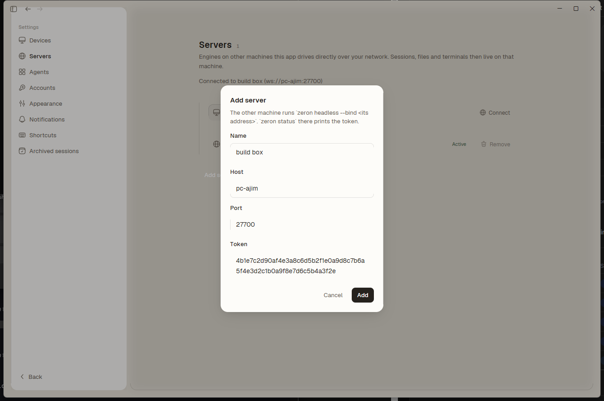
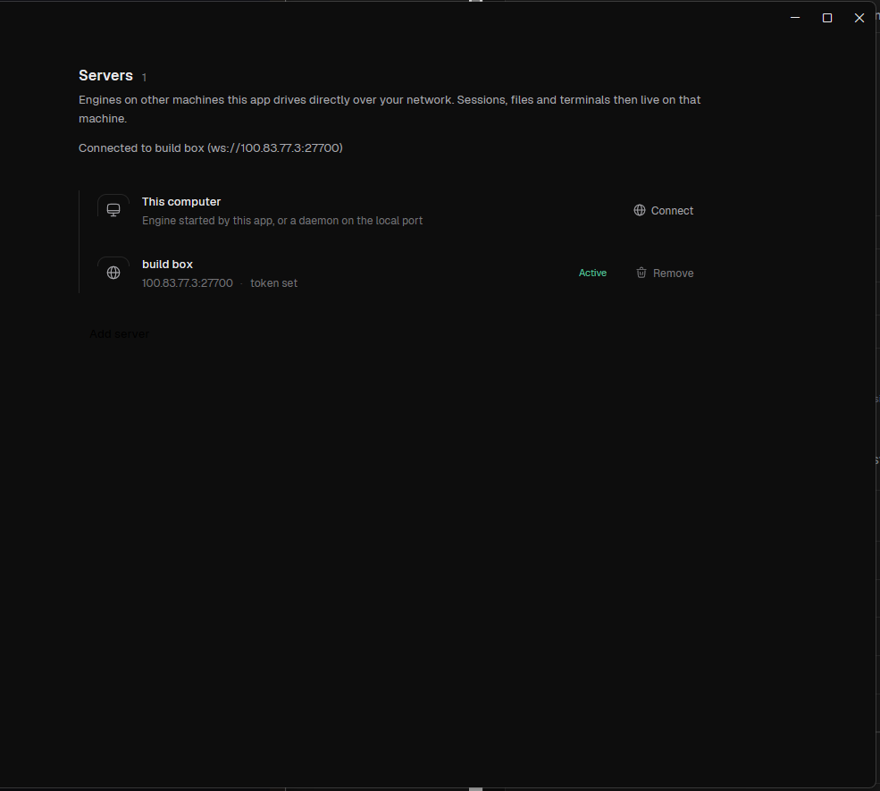
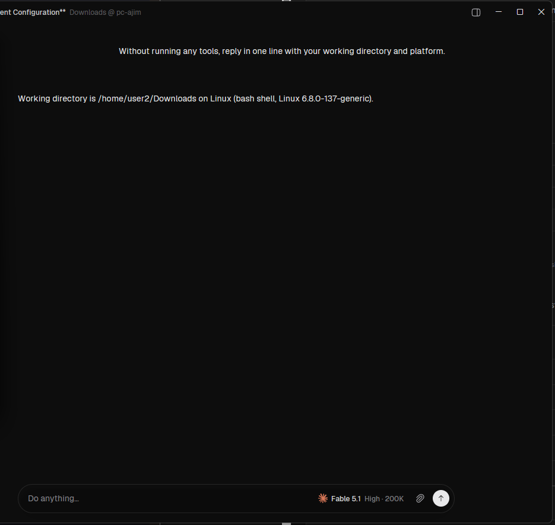

# Quickstart: run surya on your own machines

You need two things: the engine on the Linux box that runs the agents, and the app on the Windows machine you sit at.
They talk directly over your own network (LAN, VPN or tailnet). No account, no cloud in between.

```
Windows machine                         Linux box
+-------------------+   ws://host:27700  +------------------------+
| surya app         | -----------------> | surya engine           |
| (surya.exe)       |   + shared token   | runs Claude Code, git, |
|                   | <----------------- | terminals, files       |
+-------------------+   streams back     +------------------------+
```

## 1. Install the engine on the Linux box

One command, run as the user whose Claude Code login the agents should use:

```
git clone https://github.com/screamyx/surya.git
cd surya
deploy/install-engine.sh
```

It builds the engine, installs it to `~/.local/bin`, starts it as a user service, and prints what the app needs:

```
  Server (host):  100.64.0.9
  Port:           27700
  Token:          3f9c...  (64 characters)
  Dial string:    ws://100.64.0.9:27700
```

Keep that token private. Anyone who has it can run agents as you on that box.

Later on the Linux box:

| Command | What it does |
| --- | --- |
| `surya-engine status` | Is the service up, what is it bound to |
| `surya-engine token` | Print the token again |
| `surya-engine logs` | Last 50 log lines (connections show as `rpc: connection accepted`) |
| `surya-engine restart` | Restart the service |

By default the engine binds to the box's tailnet address.
For a LAN or VPN address run `deploy/install-engine.sh --bind 0.0.0.0` (every interface) or `--bind <ip>`.
Re-running the installer is safe: it rebuilds, reinstalls and keeps the token.

Requirements on the Linux box: Rust (https://rustup.rs), git, and the `claude` command logged in for that user.

## 2. Install the app on Windows

1. Unzip `surya-windows-<version>.zip` into a folder, for example `C:\surya`.
2. Double-click `surya.cmd`.

The first start opens the app with the engine built into it.
Settings and logs go to `%APPDATA%\surya`.

To build the zip yourself on a Windows machine with Rust and Visual Studio Build Tools:

```
powershell -ExecutionPolicy Bypass -File deploy\windows\build.ps1
```

The zip lands in `dist\`.

## 3. Add the server

In the app: **Settings -> Servers -> Add server**.

| Field | Value |
| --- | --- |
| Name | anything, for example `build box` |
| Host | the Server (host) line from the installer |
| Port | `27700` |
| Token | the Token line from the installer |



Press **Add**, then **Connect** on the new row.
The status line on that page says `Connected to build box (ws://...)` when it worked.
The app remembers the choice and dials that server the next time it starts.



Two other ways to point the app at a server:

- Put `{"engine":"ws://100.64.0.9:27700","token":"..."}` in `%APPDATA%\surya\servers.json` before starting `surya.cmd`.
- Run `surya.cmd --engine ws://100.64.0.9:27700 --engine-token <token>`.

## 4. Start a chat

1. Open the project menu at the top of the sidebar and pick **New project**.
2. The folder list shows the Linux box. Pick a folder there (Enter opens a folder, Ctrl+Enter uses the open one).
3. Type in the box at the bottom and press Enter.

The agent runs on the Linux box in that folder. The reply streams back to Windows.



## If something is off

| You see | Why | Do |
| --- | --- | --- |
| `Not connected: ... 401` on the Servers page | Wrong token | `surya-engine token` on the Linux box, fix the row |
| `Not connected: ... timed out` | Host unreachable or the engine is down | `surya-engine status`; check both machines are on the same network |
| Installer says `port 27700 is held by pid ...` | Another engine on that port | Stop it, or re-run with `--port 27701` and use that port in the app |
| The service dies right after start | Bind address not on this box | `surya-engine logs`; re-run the installer with `--bind <ip that this box has>` |
| Agent never answers | `claude` not on the service PATH or not logged in | `surya-engine logs`; log in with `claude` as that user |

The link is not encrypted by surya itself.
Use it over a tailnet, a VPN or a trusted LAN, never over the open internet.
